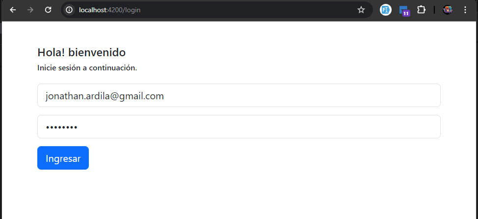
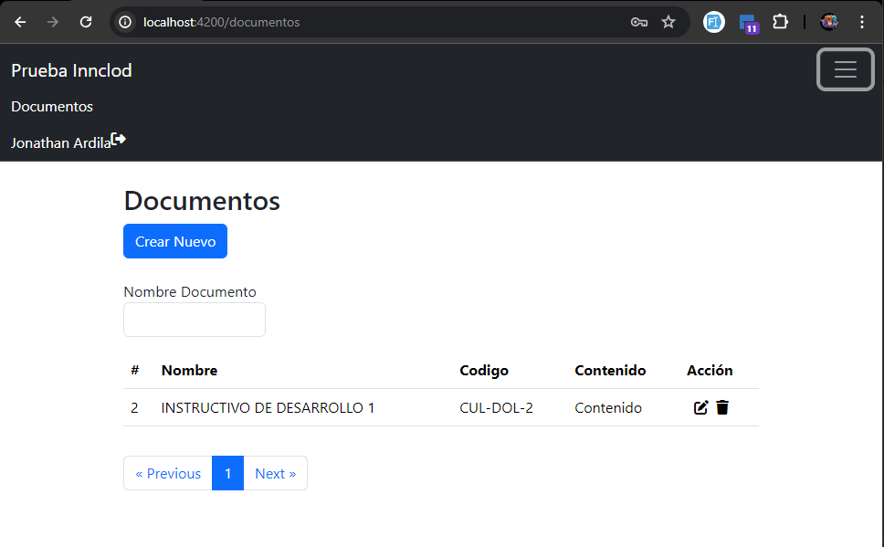
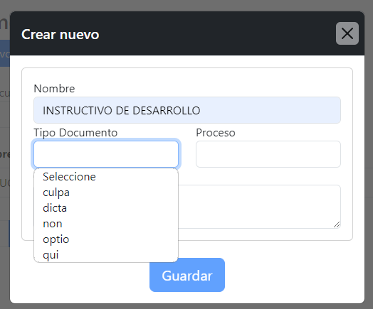
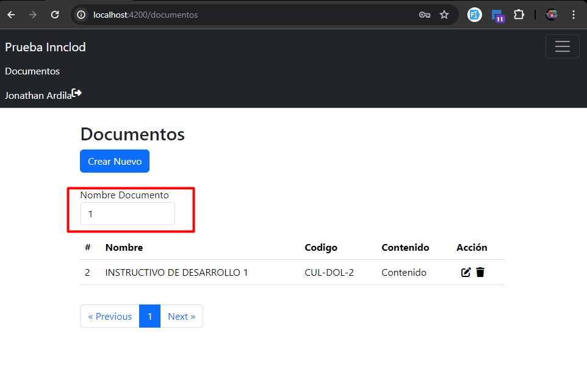
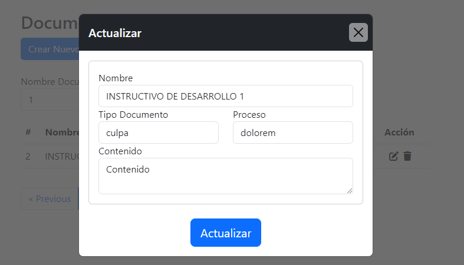
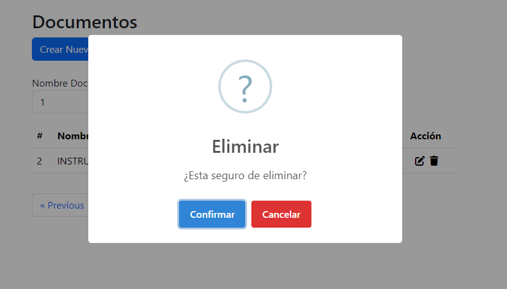
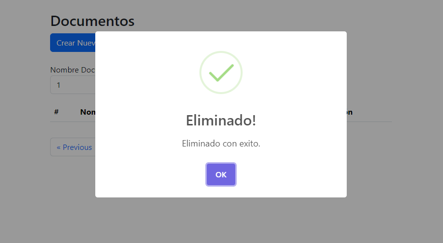
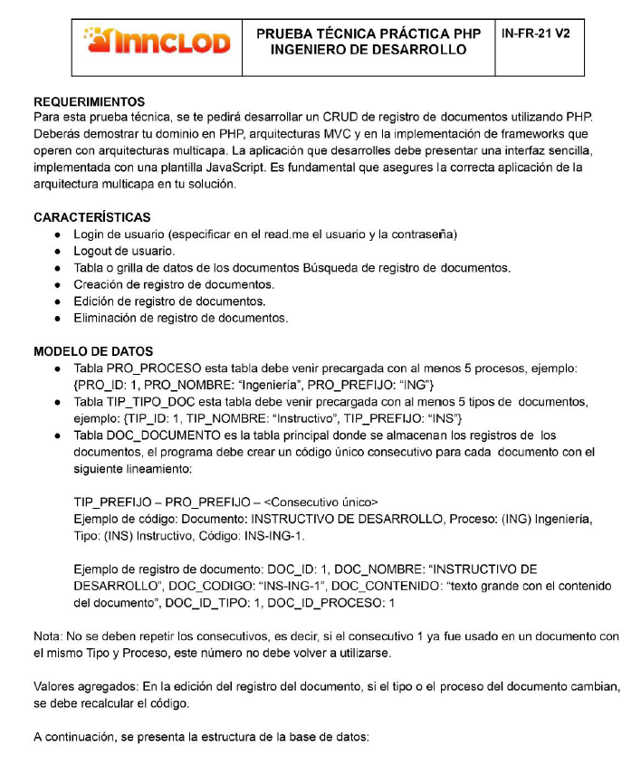
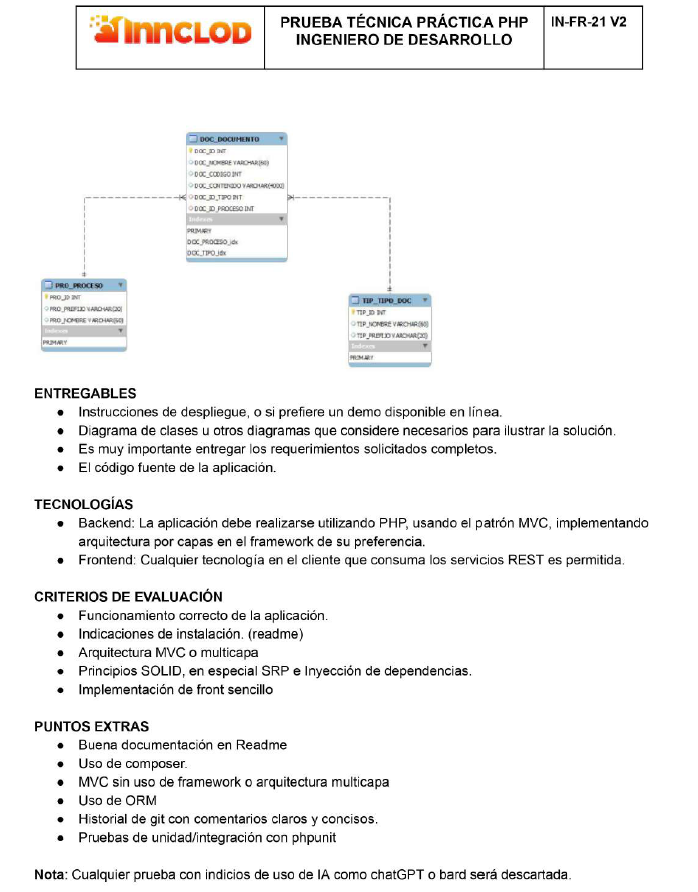
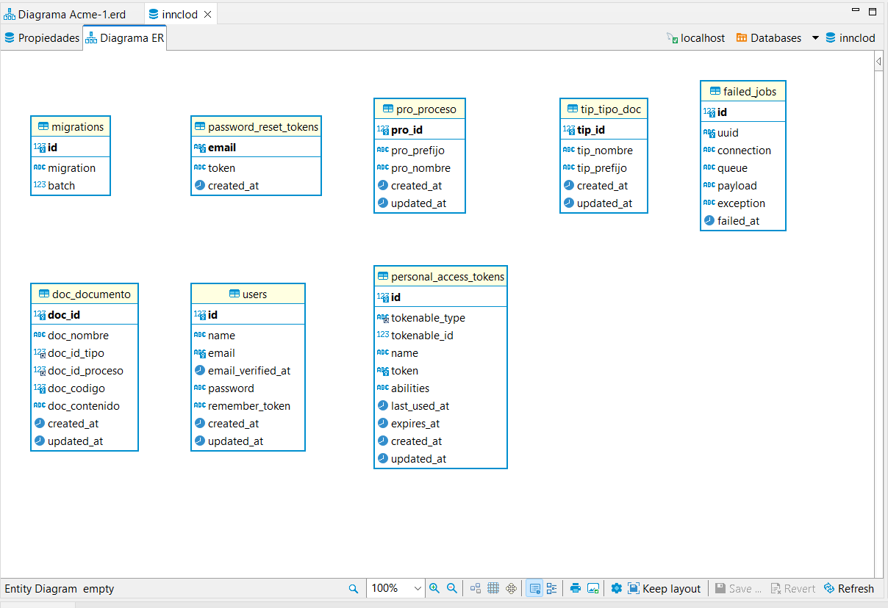

# Prueba de InnClond 

## Iniciar Backend Laravel 10

1) Descargar el clone del proyecto

```sh
git clone https://github.com/Jonathanmzd/prueba-innclod.git
```

2) Copiar env.example 
   
3) Crear archivo .env en la raiz, copiar lo de env.example dentro

4) tener presente esta conexion
   
```env
DB_CONNECTION=mysql
DB_HOST=127.0.0.1
DB_PORT=3306
DB_DATABASE=innclod
DB_USERNAME=root
DB_PASSWORD=
```

5) dentro del lugar donde se descargo el repositorio se realiza lo siguiente:
   
```sh
cd backend
composer install 
```

6) Realizar la creacion de la clave 
```sh
php artisan key:generate
```

7) realizar la ejecucion de las migraciones
```sh
php artisan migrate:refresh --seed
```

8) Ejecutar el Backend
```sh
php artisan serve
```

## Iniciar Frontend

1) dentro del lugar donde se descargo el repositorio se realiza lo siguiente:
   
```sh
cd frontend
npm install 
```

2) iniciar el proyecto
```sh
npm start
```

## Imagenes del proyecto:

**Login**



```sh
email: jonathan.ardila@gmail.com
Password: password
```

**Tabla Documentos**



**Nuevo Documento**



**Buscador**



**Actualizar**



**Eliminar**





**Condiciones de la prueba**





**Diagrama de entidad relacion db innclod**


